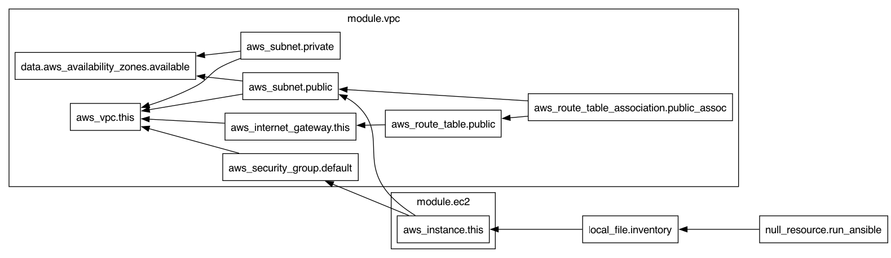

# Terraform Project Documentation

## Overview
This project contains Terraform code to provision infrastructure.

---

## Providers
- **aws**

---

## Modules
- **vpc** (source: `./modules/vpc`)
- **ec2** (source: `./modules/ec2`)

---

## Resources
- **aws_instance** → EC2 virtual machine instance
  - **this**

- **aws_internet_gateway** → Internet Gateway for public internet access
  - **this** → # Internet Gateway

- **aws_route_table** → Route Table for directing network traffic
  - **public** → # Public Route Table

- **aws_route_table_association** → Terraform resource
  - **public_assoc** → # Route Table Association for Public Subnet

- **aws_security_group** → Firewall rules for controlling inbound/outbound traffic
  - **default**

- **aws_subnet** → Subnet inside a VPC
  - **public** → # Public Subnet
  - **private** → # Private Subnet

- **aws_vpc** → Virtual Private Cloud (network)
  - **this**

- **local_file** → Terraform resource
  - **inventory**

- **null_resource** → Terraform resource
  - **run_ansible**

---

## Variables
- **aws_region** (default: `ap-south-1`) → AWS region to deploy resources
- **vpc_cidr** (default: `No default`) → CIDR block for the VPC
- **vpc_name** (default: `No default`) → Name tag for the VPC
- **public_subnet** (default: `No default`) → CIDR block for public subnet
- **private_subnet** (default: `No default`) → CIDR block for private subnet
- **ami_id** (default: `No default`) → AMI ID for the EC2 instance
- **instance_type** (default: `No default`) → EC2 instance type
- **key_name** (default: `No default`) → Key pair name for SSH access
- **instance_name** (default: `No default`) → Tag name for the EC2 instance
- **private_key_path** (default: `No default`) → Path to private key file for Ansible SSH
- **ec2_count** (default: `1`) → Number of EC2 instances to create
- **vpc_cidr** (default: `No default`) → CIDR block for the VPC
- **vpc_name** (default: `No default`) → Name tag for the VPC
- **public_subnet** (default: `No default`) → CIDR block for public subnet
- **private_subnet** (default: `No default`) → CIDR block for private subnet
- **ami_id** (default: `No default`) → AMI ID for the EC2 instance
- **instance_type** (default: `No default`) → EC2 instance type
- **key_name** (default: `No default`) → Key pair name for SSH access
- **subnet_id** (default: `No default`) → Subnet ID to launch instance in
- **security_groups** (default: `No default`) → List of security groups for the instance
- **instance_name** (default: `No default`) → Tag name for the EC2 instance
- **disk_size** (default: `20`) → Size of the root disk in GB

---

## Outputs
- **vpc_id** → No description
- **public_subnet_id** → No description
- **private_subnet_id** → No description
- **ec2_instance_id** → No description
- **ec2_public_ip** → No description
- **vpc_id** → No description
- **public_subnet_id** → No description
- **private_subnet_id** → No description
- **default_sg_id** → No description
- **instance_id** → No description
- **public_ip** → No description
- **public_ips** → No description

---

## Architecture Diagram

---
*Generated automatically from Terraform code.*
